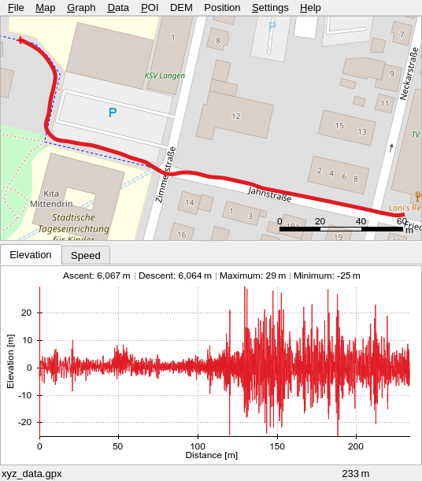

# 🚲📱📈 - Bicycle path surface quality measured with the smartphone

This repository contains various scripts for analyzing the bicycle path surface quality
by examining the measured z-acceleration of vibrations you phone experiences during a bike ride.

* `radweganalyse.sh` (uses `acceleration_selection.py` for maximum peak detection)
* `phyphox2dat.awk` (faster, currently without peak detection)

The `radweganalyse.sh` script was the first one created for this project. It provides
a number of options and utilizes the python script `acceleration_selection.py` for further
analysis (see below).

The awk script `phyphox2dat.awk` has basically the same purpose as the bash script, but
it is much faster and depends only on awk. Also it produces a simple *.dat file
which could be used for data analysis with other software such as gnuplot.

The main purpose of the scripts above is to convert exported GPS data and acceleration
data measured with the app [phyphox](https://phyphox.org/) into a GPX file for graphical
analysis of the bike path quality or into data which can be further analyzed.

As an example, here is a screenshot of the GpxSee program where a created GPX file from
a measured bike path is shown. On the top side of the screenshot one can see the bike path.
On the lower end the measured acceleration in z-direction is shown. Because of the quite
different surface qualities (smooth vs. bumpy), there is a big difference in the
measured data.

## Setup

In this repository you will find the experiment description file
[radweganalyse.phyphox](radweganalyse.phyphox) which can be imported into the phyphox
app via the below QR-Code:

For importing it, open the phyphox app, press the "+" button on the lower right and select
the QR-Code shown here. This will create a new experiment entry called "Radweganalyse",
for the parallel read-out of the GPS sensor and the acceleration sensor of your mobile phone.

After a ride with your bike, export the measured data as CSV files. These files are located
on the smartphone as a zip archive. This zip needs to be copied over to your PC. Unzip it
into a new folder.

## Data Processing

After measuring and exporting the data as CSV files to you computer, execute the script
`radweganalyse.sh` in the same directory where you have placed the files.

The script also contains unit tests which can be executed by `radweganalyse.sh --test`. If all
tests pass you can be sure that the script is doing what it should be doing.

Without adding any arguments, the script will create the output file `xyz_data.gpx` for
the complete data set. Exporting the data as a csv file is also possible.

The python script `acceleration_selection.py` is used automatically to find the maximum
z-acceleration in the measured data.

Executing `radweganalyse.py --help` will show you a additional script options.

Executing the awk script is also simple: `gawk -f phyphox2dat.awk` (within the same directory
where the measured data files are located). This will generate two files: `Interpol.gpx`
and `Interpol.dat` for further processing.

For your convenience, there are already two gnuplot scripts available, which can provide
an overview about the measured data:

* `plotZAcceleration.gnu` - plots a z-Acceleration heatmap using Interpol.dat
* `plotVelocity.gnu` - plots a velocity heatmap using Interpol.dat

Use gnuplot to visualize this data through `gnuplot -p plotZAcceleration.gnu`.

## Dependencies

Currently, `radweganalyse.sh` depends on the following software:

- sample1d: This tool is part of the Generic Mapping Tools (GMT) package. Install GMT with `sudo apt-get install gmt`
- gpsbabel: This tool is a standalone program, also available in many linux distributions. Install with `sudo apt-get install gpsbabel`

Other dependencies should be awailable on a standard Linux system.

Further, the shell script calls a python script for data analysis. You need to install python on your system and the `pandas` package: `sudo apt-get install python3-pandas`
